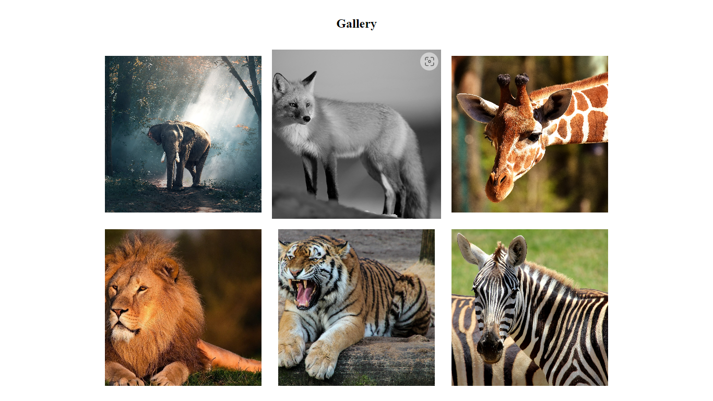

## Gallery

Gallery using JavaScript, HTML and CSS only. No framework or libraries. Also it has some animation and it is responsive.

When you click at any image, a modal will appear with 100% of height and width. To close the modal, need to click outside of the modal or at X button above.

# Languages used

* HTML
* CSS
* JavaScript

# How can I use it?

First, you can clone the project at your folder. Use the command line:

 > git clone https://github.com/Vinicius-PR/Gallery-JS-Vanilla.git
 
Then you will have all the code. Just open the index.html at your browser to see the result.
 
 # ScreenShot

 
 